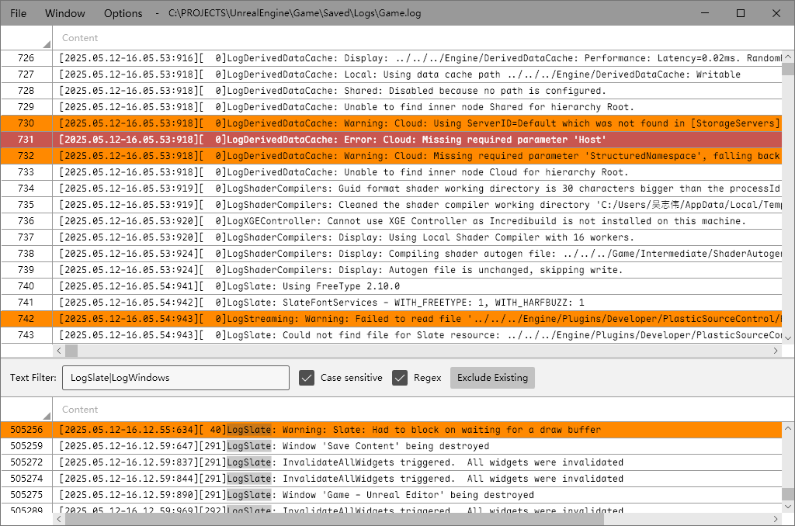
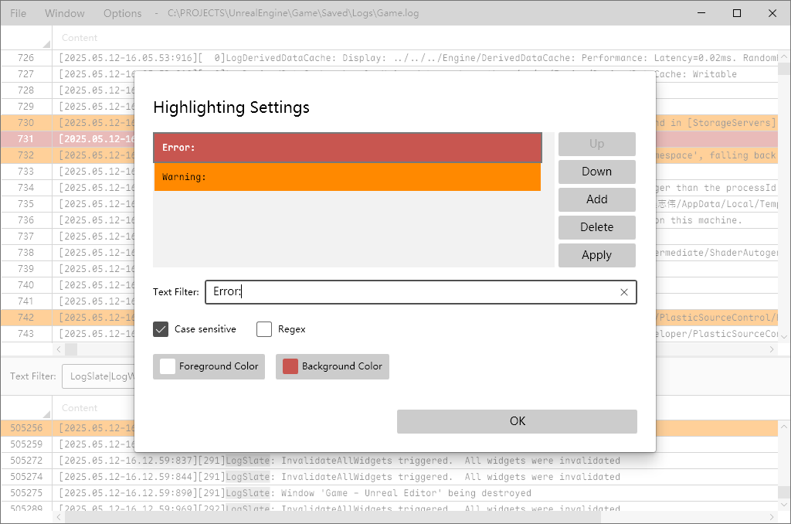
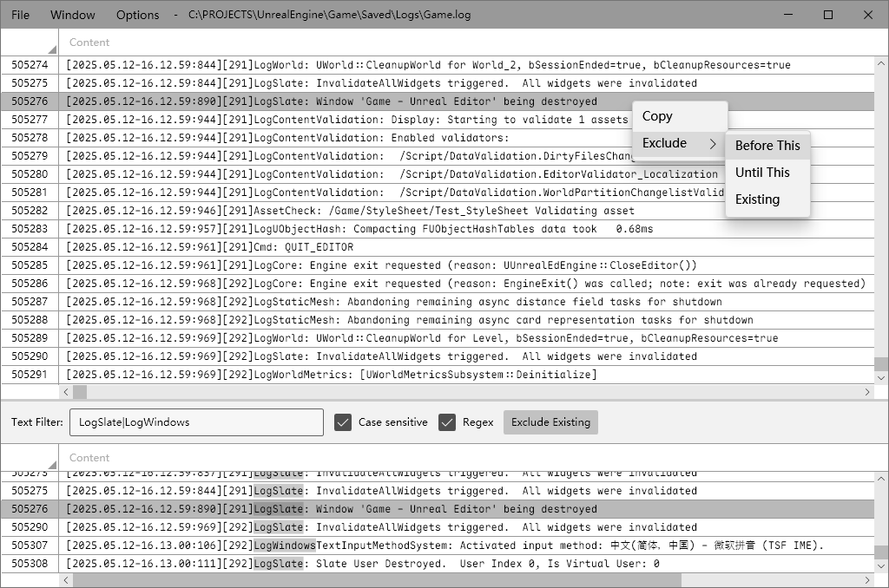
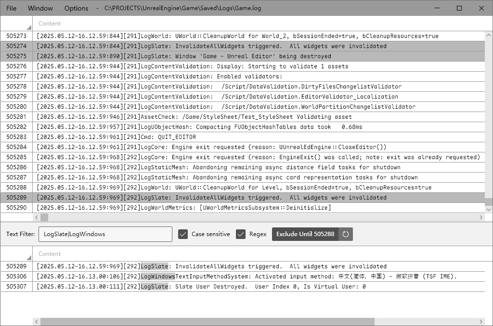
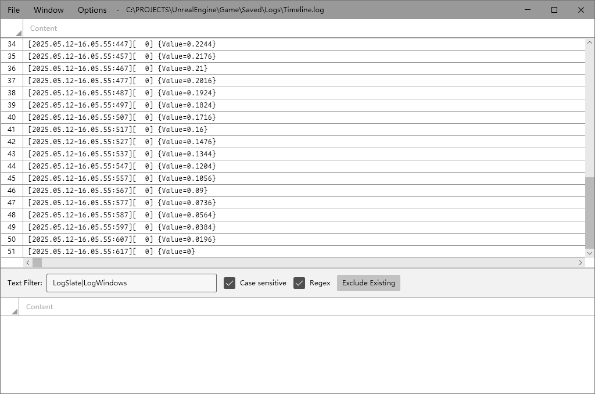
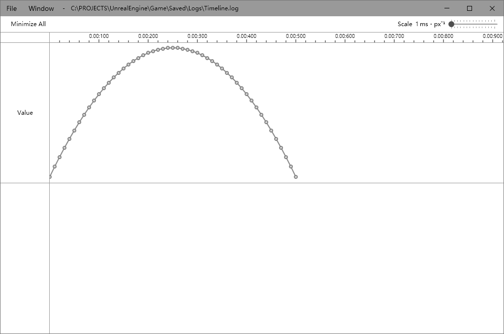

# LogGenius

LogGenius is a lightweight, scalable log viewer for Windows.



## Feature

**Highlight**

The Highlight Settings dialog lets you customize colors for different matches, with options for case sensitivity and regular expressions:



**Filter with the log number**

Through the sub-items of the `Exclude` menu by right-clicking on a log entry, or by directly clicking the `Exclude Existing` button, filtering can be performed based on the log number:



Click the `Exclude Until ...` button to cancel the filtering. Click the refresh button on the right to reset the filter position to the current last entry:



**Timeline**

LogGenius will automatically parse variable assignment statements that conform to the following format:

```
{SomeVariable=0.618}
```

For example, you can output the sampling results of a parabola (currently, only Unreal's log date format is supported):



Click the menu `Window - Timeline` to display the variable's curve in a timeline view:

